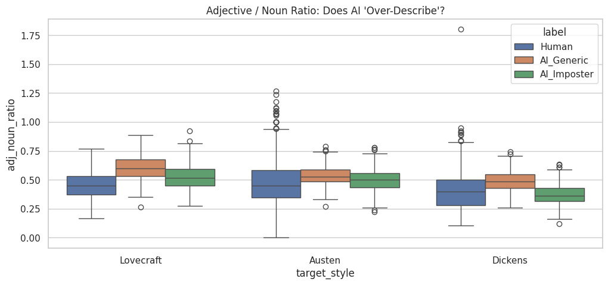
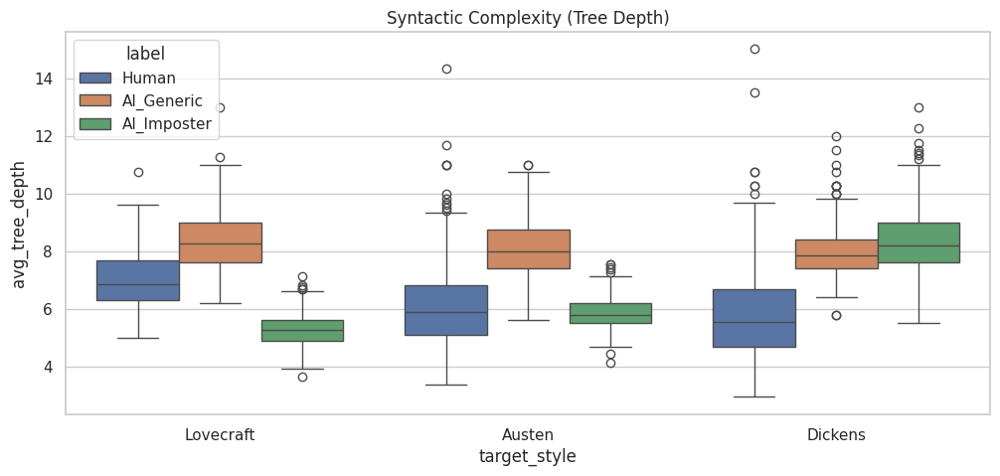
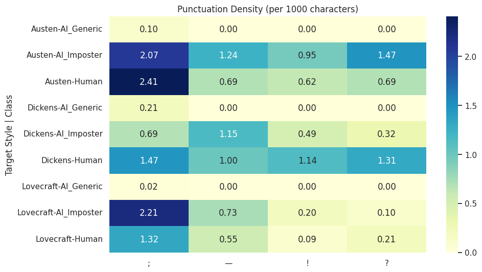
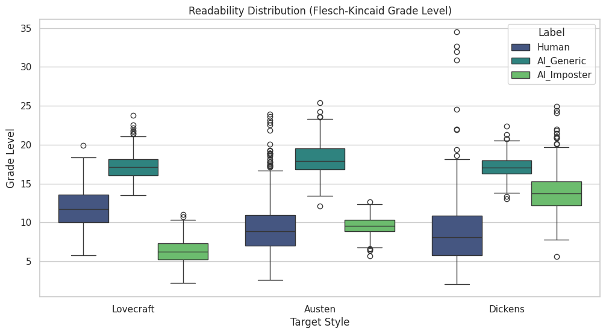
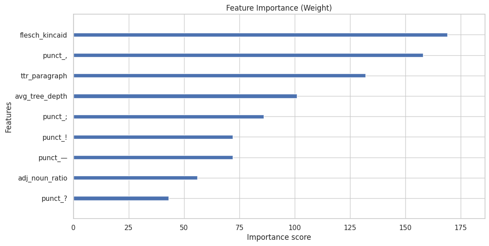
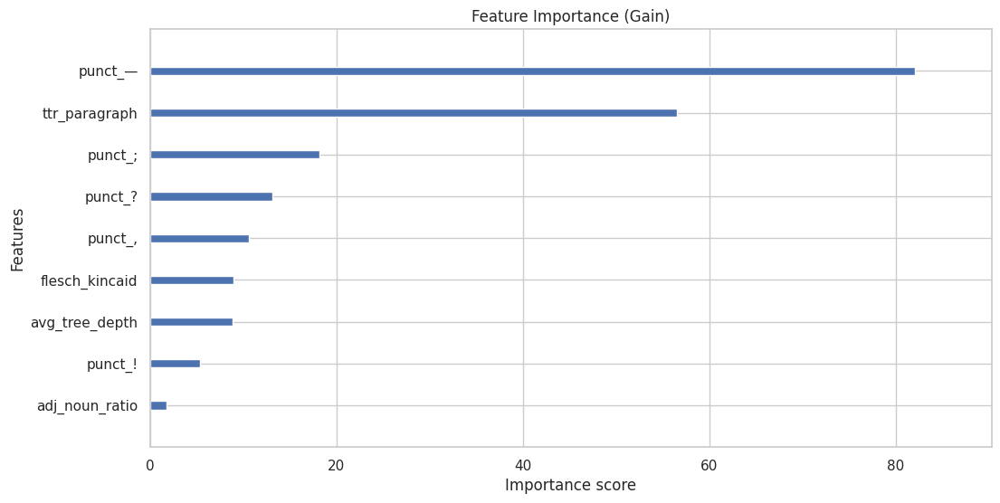
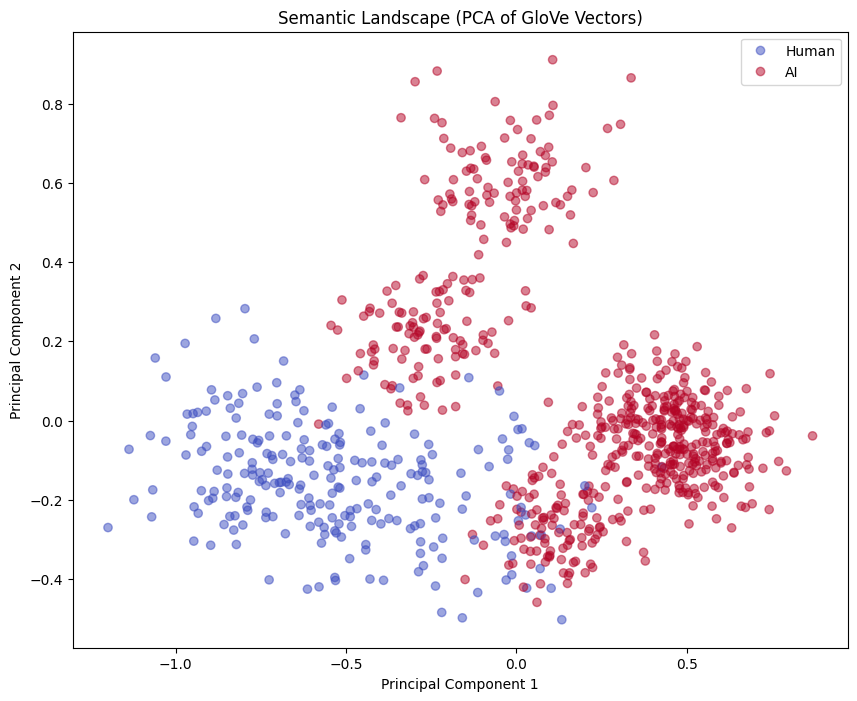
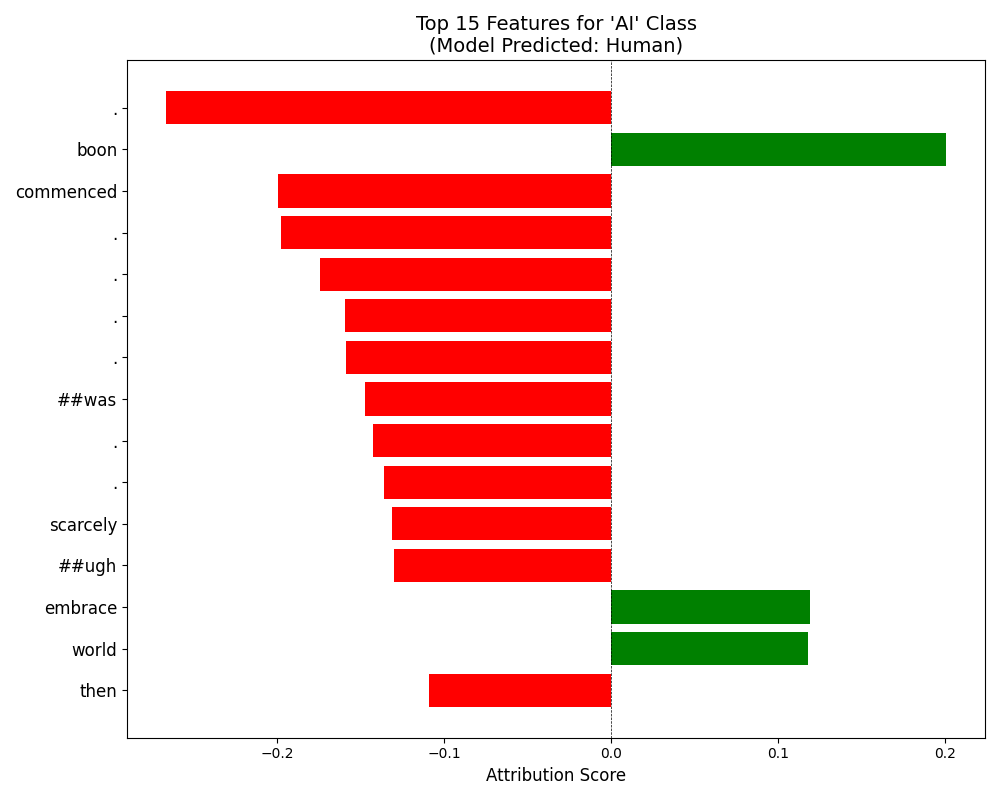
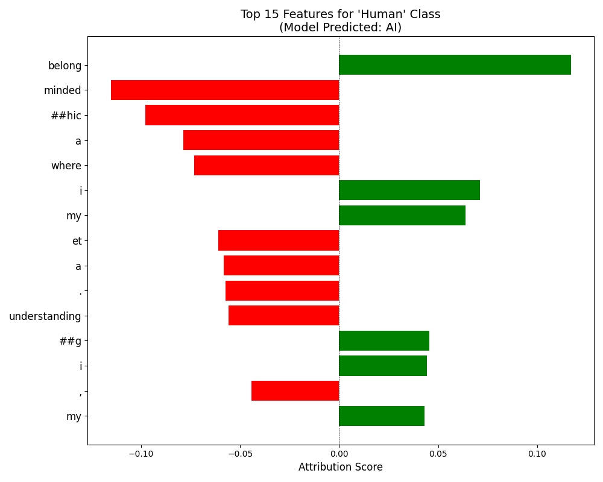

# The Ghost in the Machine

**Project Author:** Abhiraj Ratna — 2024114011

## Methodology

The novels that I chose are The Call of Cthulhu-H.P. Lovecraft, Pride and Prejudice-Jane Austen and The Tale of Two Cities-Charles Dickens. 

For topics I just asked gemini to tell me key topics in these books

**The Call of Cthulhu** - Insignificance of Humans Cosmically.
Forbidden Knowledge,
Ancient, Alien Gods,
Mental Collapse due to Cosmic Truth,
Cults and Secret Society,
Human Curiosity brings Destruction,
Ancient Awakening after Eons of Sleep,
Decay of Civilizations

**Pride and Prejudice** - Misjudgement,
Social Bias,
Marriage as Economic Strategy,
Love vs Convenience,
Women navigating limited choices with intelligence and resistance.,
Reputation and Honor,
Influence of Family in Personal Decisions,
Moral Growth from their own Errors,
Politeness and Manners as Strategic Behavior.

**The Tale of Two Cities** - Power imbalance between social classes,
Political Revolt and Violence,
Personal Sacrifice for Moral or Emotional causes,
Characters evolving psychologically and Socially under pressure,
Justice, Punishment and Revenge,
Love, Loyalty and Relationships as motivating forces,
Suffering Improsenment and Trauma

I then prompted gemini to write paragraphs on these topics and then I used those paragraphs as the AI generated text for my dataset. I made sure to prompt it such that the text generated would have punctuations, its complexity will be less and won't have a lot of depth. Otherwise there was just a lot of difference in the text generated and the novels. I also gave the prompt actual examples from the novel. I used multithreading for faster output.

I then was giving the model the 4 randomly picked paragraphs from novels as examples.
## Task 0: The Library of Babel (Dataset Construction)
[Code](../notebooks/task0.ipynb)

### Changes Made

- Manually removed the initial and end headers
- Removed the Project Gutenberg license and Table of Contents

### Paragraph Segmentation

Performed paragraph segmentation to ensure the model is not trained on correlations between text length and authenticity (long text = human, short text = AI).

### Capitalization and Punctuation

Initially considered lowercasing all text, but decided against it because:
- Capitalization affects sentence structure and noun usage
- Removing punctuation would interfere with Task 1

### Illustration Removal

Removed numerous instances of `[Illustration]` tags from Pride and Prejudice. These included:

**Example 1:**
```
[Illustration: M^{r.} & M^{rs.} Bennet

[_Copyright 1894 by George Allen._]]
```

**Example 2:**
```
[Illustration:

     "He rode a black horse"
]
```

**Regex used:** `\[Illustration:.*?\]\]?`

### Italics Removal

Now gutenberg uses underscore to write in italics which I will have to remove as it is not part of Jane Austens writing
so I will remove them by `text = re.sub(r"_([^_]+)_", r"\1", text)` 

### Prompting for paragraph generation

I prompted such that the text output would have punctuations, its complexity will be less and won't have a lot of depth. Otherwise there was just a lot of difference in the text generated and the novels. I also gave the prompt actual examples from the novel. I used multithreading for faster output.


## Task 1: The Fingerprint (Stylometric Analysis)
[Code](../notebooks/task1.ipynb)  
Proof of distinction showed

### A. Lexical Richness (Vocabulary)
I calculated the Type-Token Ratio (TTR) and Hapax Legomena (unique words appearing once) on a normalized 5,000-word sample per class.

| Label | Target | TTR | Hapax_Legomena |
|-------|--------|-----|----------------|
| AI_Generic | Austen | 0.1538 | 339 |
| AI_Generic | Dickens | 0.1440 | 318 |
| AI_Generic | Lovecraft | 0.1576 | 347 |
| AI_Imposter | Austen | 0.1818 | 456 |
| AI_Imposter | Dickens | 0.2748 | 829 |
| AI_Imposter | Lovecraft | 0.1942 | 437 |
| Human | Austen | 0.2810 | 932 |
| Human | Dickens | 0.2782 | 883 |
| Human | Lovecraft | 0.3526 | 1203 |

The very generic prompt was giving the least TTR and hapax, upon specifically telling gemini about it, the TTR and Hapax went up but was still much lower than the actual novel. Other than in Dickens for some reason, where the TTR and hapax was almost the same as the actual novel. 

### B. Syntactic Complexity (Tree Depth & POS)
Using spaCy, I analyzed the structural complexity of the sentences.

After carrying out different prompts, I managed to bring the pos ratio roughly similar for both imposter text and actual novel text. 
Although the tree depth, was initally very consistently higher than the novel, after telling it explicitly to not be very complex, the imposter text was on an avg less complex than actual novel. 




### C. Punctuation Fingerprint
I generated a heatmap of punctuation density (semicolons, em-dashes, exclamation marks) normalized per 1,000 characters.



### D. Flesch-Kincaid
 I used the [textstat](https://pypi.org/project/textstat/) python package.


## Task 2: The Multi-Tiered Detective
[Code 1](../notebooks/task1.ipynb)<br>
[Code 2](../notebooks/task2B.ipynb)<br>
[Code 3](../notebooks/task2C.ipynb)

three distinct models made.

### Tier A: XGBoost

**Features Used**


| Feature | Description |
|---------|-------------|
| `adj_noun_ratio` | Adjective to Noun Ratio |
| `avg_tree_depth` | Average dependency tree depth |
| `flesch_kincaid` | Flesch Kincaid readability score |
| `ttr_paragraph` | Type-Token Ratio per paragraph |
| `punctuation_freq` | Frequencies of `;`, `!`, `—`, `--`, `?` |


**Test set performance**

Accuracy: **0.9762**

### Classification Report:
| Class   | Precision | Recall | F1-Score | Support |
|---------|-----------|--------|----------|---------|
| Human   | 0.96      | 0.96   | 0.96     | 241     |
| AI      | 0.98      | 0.98   | 0.98     | 601     |

**Overall Accuracy:** 0.98 (Total Samples: 842)

### Averages:
- **Macro Average:** 0.97 (Precision: 0.97, Recall: 0.97, F1-Score: 0.97)
- **Weighted Average:** 0.98 (Precision: 0.98, Recall: 0.98, F1-Score: 0.98)

AI kind of fails at imporsanating basic punctuation and syntactic complexity, but it does well at mimicking the vocabulary.

I used the xgb_plot_importance function to plot the feature importance and it showed that the most important features were the punctuation frequency and the syntactic complexity.




### Tier B: Neural Network (SpaCy + GloVe)
- **Input:** Averaged spaCy/GloVe vectors (96-dim) representing paragraph meaning
- **Model:** 3-layer feedforward neural network, 2 hidden layers
I transform the dimensions from 96 to 128 dimensions, then 64 and then 1. I used relu activation for the hidden layers and sigmoid for the output layer. In every layer I used dropout of 0.3 to prevent overfitting. I used BCE loss and Adam optimizer.
Batch Size was 32 and I trained for 20 epochs.
- **Results:**
    - **Accuracy:** 99.2%
    - **Classification Report:**

    | Class | Precision | Recall | F1-Score | Support |
    |-------|-----------|--------|----------|---------|
    | Human | 0.98      | 0.99   | 0.98    | 241     |
    | AI    | 0.99      | 0.98   | 0.98    | 601     |
    | **Overall** | **0.99** | **0.98** | **0.98** | **842** |

    - **Confusion Matrix:**

    |           | Predicted Human | Predicted AI |
    |-----------|-----------------|--------------|
    | **Actual Human** | 238 | 4 |
    | **Actual AI**    | 3   | 596 |

- **Analysis**
	- **PCA Visualization:** 
    

### Tier C: The Transformer (DistilBERT + LoRA)

This performs TOOO well. Probably because the dataset is small it won't work well in a real world scenario, but it is still interesting to see that it can learn the patterns in the data so well.
- **Methodology:** Fine-tuned distilbert-base-uncased using LoRA
- **Efficiency:** Trained only ~1% of parameters (targeting `q_lin`, `v_lin` attention modules)
- **Training Results:**

| Epoch | Training Loss | Validation Loss | Accuracy |
|-------|---------------|-----------------|----------|
| 1     | No log        | 0.044796        | 0.9905   |
| 2     | No log        | 0.015703        | 0.9964   |
| 3     | 0.132969      | 0.013144        | 0.9964   |

I guess the dataset is very easy to learn/memorize for the model.

## Task 3
[Code](../notebooks/task3.ipynb)

Using Captum (LayerIntegratedGradients), I visualized token-level contributions to the model’s decision.

Some notable things are picking up of certain words like "Family", also exclamation marks and punctuations are being flagged as human in this because of 
books having more of these tokens. A word like 'london' or some other location or to be heavily used in the human text and not in AI text(only used once in all the 500 paragraphs) 
### Findings: The "AI-isms"



Now to find erroneous classifications, I iterated through all the paragraphs from all the books, and found 16 paragraphs from HP Lovecraft's "The Call of Cthulhu" that were classified as AI-generated. No paragraphs from the other two novels were misclassified.

### Error Analysis (False Positives)
Now I think a massive reason for this is that the model is not very well trained on Lovecraft's novel because of its small size, its only 73 paragraphs, whereas the others have more than 300 paragraphs. So the model is not able to learn the patterns of the novel well and is just classifying it as AI.

Upon testing on some actual AI generated text, model was able to classify it correctly with a good enough confidence score. Its not that bad afterall.

## Task 4: The Turing Test
[Code](../notebooks/task4.ipynb)

I implemented a genetic algorithm (GA) to evolve an AI paragraph until it fooled the Tier C detector.

### Algorithm Workflow
- **Genesis:** 10 Gemini-generated paragraphs
- **Selection:** Top 3 paragraphs with the highest "Human Probability" score
- **Mutation:** Gemini prompted to apply one of 5 humanization strategies per generation:
    1. Vary sentence length significantly (short, punchy sentences mixed with longer ones)
    2. Introduce subtle, archaic grammatical phrasing typical of the 19th century
    3. Remove generic transition words like "Furthermore" or "Moreover"
    4. Add specific, vivid sensory details (smell or texture) that feel uncomfortably real
    5. Rewrite to sound less structured and more like stream of consciousness

    At each mutation step, one strategy is randomly selected and applied via Gemini prompt.
    

- **Generations:** Run for 10 generations

### Results
- **Starting Score:** 0.0067
- **Final Score:** 0.9019
- **The "Super-Imposter" Paragraph:**
	- That clock, perchance you recall it, the one set within the hall, a grandfatherly sort it was, fashioned of dark wood, quite shrouded in dust, as though it simply *dwelt* there, you apprehend, a silent witness to all. And a creak it emitted, a sorrowful, ancient sound, and the motes of dust, one could descry them whirling, catching those slivers of moonbeam, held in ethereal suspension. The works within, good heavens, so sluggish, all rusted, a true grinding it was, a weighty heartbeat in the stillness. And the pendulum, that brass apparatus, worn so smooth, one might almost feel all the hands, all the bygone years, just oscillating, back and forth, a murmur, perhaps a specter. And when it struck… 'twas as if all that hath passed, all the merriment, every spirit, just… time advancing, ever onward.


### The Personal Test
I ran my own Statement of Purpose (SOP) through the detector.
this is my SOP

    I am very interested in problems involving mathematics, machine learning, NLP and quantitative finance, probability and statistics, reinforcement learning and stochastic processes. I am interested in doing research in these fields with like minded people, which I feel I can find in Precog. I feel I would be a strong fit because of my interdisciplinary orientation. I actively seek feedback to refine my understanding. I feel like this is a place where my interests and work ethic naturally belong.
    

- **Prediction:** AI
- **Confidence:** 81%

Upon simply changing the words that were the most exciting features into there synonyms I was able to convert this back to human.
